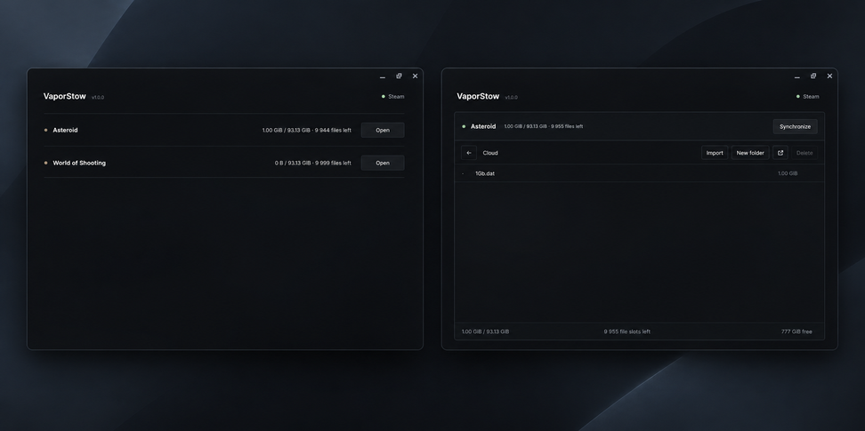

<p align="center">
    
</p>

<h1 align="center">
    <strong>VaporStow</strong>
</h1>

---

<p align="center">
    ☁️ Cross-platform Steam Cloud file manager for supported games.
</p>

<p align="center">
    <a href="https://github.com/nullmess/VaporStow/stargazers">
        
    </a>
    <a href="LICENSE">
        
    </a>
    
</p>

<p align="center">
    
</p>

---

## ✨ Features

- Browse files in supported Steam Cloud locations
- Manage files and folders through a local desktop interface
- Automatic handling of large files within supported file-size limits
- Incremental synchronization to avoid unnecessary data transfers
- SHA-256 integrity checks
- Steam Cloud upload and download progress
- Transfer speed, ETA, and current-file tracking
- Storage usage and available file-slot tracking
- Automatic Steam detection, launch, and synchronization
- Open or reveal files in the system file manager

## 🎮 Supported Games

- Asteroid (`2020850`)
- World of Shooting (`1678150`)

---

## 🚀 Usage

VaporStow development uses **Node.js 22.x**.

### Normal workflow

```shell
fnm use 22
npm install
npm run dev
```

### Run the built desktop app

```shell
npm run app
```

### Build

```shell
npm run build
```

### Platform packages

#### Windows

```shell
npm run build-win
```

Output:

```text
release/VaporStow-windows-x64/
```

#### Linux

```shell
npm run build-lin
```

Output:

```text
release/VaporStow-linux-x64/
```

#### macOS

```shell
npm run build-mac
```

Output:

```text
release/VaporStow-macos-x64/
```

#### All targets

```shell
npm run build-all
```

Each platform is packaged into its own directory under `release/`.

### Clean

Remove generated files and installed dependencies:

```shell
npm run clean
```

---

## ⚖️ Disclaimer and Intended Use

VaporStow is an independent open-source project, not affiliated with Valve or Steam. Users are responsible for complying with Valve/Steam terms and applicable laws. We are not responsible for misuse or user-managed content.

---

## 👥 Authors

- [Nullmess](https://github.com/Nullmess)
- [Ybucaille](https://github.com/Ybucaille)

Give a ⭐️ if VaporStow helped you!

---

## 📝 License

Copyright © 2026 [Nullmess](https://github.com/Nullmess) & [Ybucaille](https://github.com/Ybucaille).<br />
This project is licensed under the MIT License.
