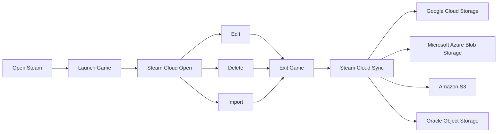

<p align="center">
    
</p>

<h1 align="center">
    <strong>VaporStow</strong>
</h1>

---

<p align="center">
    ☁️ Cross-platform Steam Auto-Cloud file manager.
</p>

<p align="center">
    <a href="https://github.com/nullmess/VaporStow/releases/latest">
        
    </a>
    <a href="LICENSE">
        
    </a>
    
</p>

<p align="center">
    
</p>

---

## ✨ Features

- Browse and manage compatible Steam Clouds.
- Generic Steam Auto-Cloud support, including restricted and non-recursive rules.
- Cloud search, filters, favorites and circular carousel.
- File and folder management with Advanced Search.
- Normal, Mirror and Reed–Solomon multi-Cloud storage.
- Drag and drop importing with protected-storage tags.
- Large-file splitting and reconstruction.
- Incremental synchronization with progress, speed and ETA.
- Cloud usage, quota and file-slot tracking.
- Automatic Steam detection, launch and synchronization.
- App metadata, artwork and outside-library discovery.
- Windows, Linux and macOS support.

## ☁️ Steam Cloud workflow


```mermaid
flowchart LR
    A[Open Steam] --> B[Launch Game]
    B --> C[Steam Cloud Open]

    C --> D[Edit]
    C --> E[Delete]
    C --> F[Import]

    D --> G[Exit Game]
    E --> G
    F --> G

    G --> H[Steam Cloud Sync]

    H --> I[Google Cloud Storage]
    H --> J[Microsoft Azure Blob Storage]
    H --> K[Amazon S3]
    H --> L[Oracle Object Storage]
```

## 🚀 Usage

VaporStow development uses **Node.js 22.x**.

### Normal workflow

```shell
fnm use 22
npm ci
npm run dev
```

### Run the built desktop app

```shell
npm run app
```

### Platform packages

#### Windows

```shell
npm run build-win
```

Output:  `release/VaporStow-windows-x64/`

#### Linux

```shell
npm run build-lin
```

Output: `release/VaporStow-linux-x64/`

#### macOS

The DMG must be packaged on macOS:

```shell
npm run build-mac
```

Output: `release/VaporStow-macos-x64/`

### Clean

Remove dependencies, generated files and caches:

```shell
npm run clean
```

---

## ⚖️ Disclaimer and Intended Use

VaporStow is an independent open-source project, not affiliated with Valve or Steam. Users are responsible for complying with Valve/Steam terms and applicable laws. We are not responsible for misuse or user-managed content.

---

## 👥 Authors

- [Nullmess](https://github.com/Nullmess)
- [Ybucaille](https://github.com/Ybucaille)

Give a ⭐️ if VaporStow helped you!

---

## 📝 License

Copyright © 2026 [Nullmess](https://github.com/Nullmess) & [Ybucaille](https://github.com/Ybucaille).<br />
This project is licensed under the MIT License.

